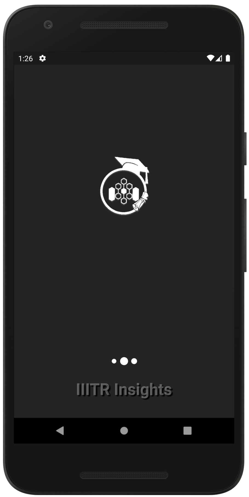
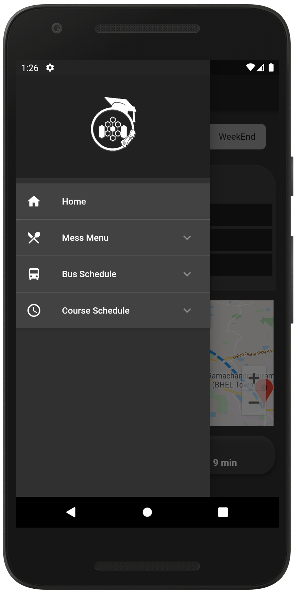

<h1>IIITR Insights</h1>

<h2>A general utility app for students of <a href="https://iiitr.ac.in/">Indian Institute of Information technology, Raichur.</a></h2> 
  

<h6 align="center">Made with ❤️ from codesoc</h6>

